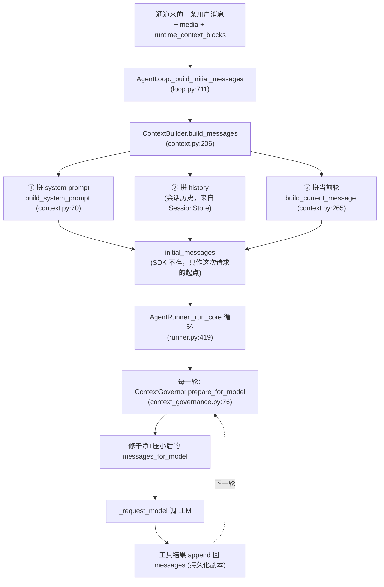

在 01 / 02 里，我们已经把 nanobot 的两条主干理清了：

- **`AgentLoop`（产品层）** 负责"一条消息从通道进来"——会话锁、持久化、权限注入；
- **`AgentRunner`（引擎层）** 负责"答案怎么从模型流出去"——模型循环、工具执行、重试。

但有一个问题我们一直绕开了：**模型到底"看到"了什么？** 你把一句话发给 Agent，可 LLM 拿到的从来不是"这句话"本身，而是一整包东西：系统人设、长期记忆、技能说明、最近 50 轮对话、你这次附带的图片、运行时注入的上下文……再加上上一轮工具调用的结果。

这一篇，我们就钻进 nanobot 负责"拼剧本"和"修剧本"的两个文件：

- `nanobot/agent/context.py`（约 314 行）—— **`ContextBuilder`**，负责"装配"，把上面那些碎片拼成 LLM 能吃的消息列表；
- `nanobot/agent/context_governance.py`（约 512 行）—— **`ContextGovernor`**，负责"治理"，在每一轮把消息"修干净、压小"再送进模型。

读完你会发现：一个看起来很简单的"调一次 LLM"，背后 nanobot 在**构造**和**裁剪**两道关卡上做了大量工程，目的只有一个——**让模型永远拿到一份"合法、不超限、信息密度高"的上下文**。这正是"上下文工程（context engineering）"这个 2025 年才火起来的词，在一个真实框架里的落地。

---

## 一、先建立全局印象：消息要经过两道关卡

把两次请求之间的数据流画出来，是理解本篇的钥匙：



注意一个**关键设计**：`ContextBuilder` 只跑**一次**（在 turn 开始时，拼出"初始剧本"）；而 `ContextGovernor` 在模型循环的**每一轮**都跑（因为每轮工具调用后 `messages` 都变了，需要重新治理）。这就是为什么 `ContextGovernor` 的方法是 `@staticmethod` 且"只改副本、不动持久化历史"——它每轮都要对一个不断变长的列表做"廉价修复"。

---

## 二、ContextBuilder：怎么把碎片拼成剧本

### 2.1 入口 `build_messages`——组装顺序就是"信息优先级"

先看最核心的组装函数（context.py:206）：

```python
def build_messages(
    self,
    history: list[dict[str, Any]],
    current_message: str,
    *,
    media: list[str] | None = None,
    channel: str | None = None,
    current_role: str = "user",
    session_summary: str | None = None,
    runtime_context_blocks: Sequence[RuntimeContextBlock] | None = None,
    workspace: Path | None = None,
    include_memory_recent_history: bool = True,
    session_key: str | None = None,
    unified_session: bool = False,
) -> list[dict[str, Any]]:
    root = workspace or self.workspace
    # 1) 从用户当前文本里，挑出被"显式 @调用"的 skill 名字
    active_skill_names = (
        self.skills.get_explicitly_invoked_skills(current_message)
        if current_role == "user"
        else []
    )
    # 2) 第一条永远是 system，里面是所有"背景知识"
    messages: list[dict[str, Any]] = [
        {
            "role": "system",
            "content": self.build_system_prompt(
                active_skill_names=active_skill_names,
                channel=channel,
                session_summary=session_summary,
                workspace=root,
                include_memory_recent_history=include_memory_recent_history,
                session_key=session_key,
                unified_session=unified_session,
            ),
        },
        *history,   # 3) 然后是持久化会话历史（user/assistant/tool 交替）
    ]
    # 4) 当前这轮的 user 消息
    current = self.build_current_message(
        current_message,
        media=media,
        current_role=current_role,
        runtime_context_blocks=runtime_context_blocks,
    )
    # 5) 如果 history 最后一条恰好也是 user（比如上一轮被打断），合并而不是再加一条
    if messages[-1].get("role") == current_role:
        last = dict(messages[-1])
        last["content"] = self._merge_message_content(
            last.get("content"), current.get("content"),
        )
        messages[-1] = last
        return messages
    messages.append(current)
    return messages
```

**这一段告诉我们的"信息优先级"，就是 nanobot 的上下文哲学：**

1. **system 永远排第一**——人设、记忆、技能、最近历史、会话摘要，全塞在 system 里。模型一开场就"知道自己的身份和背景"。
2. **history 按时间顺序排第二**——这是真实的对话流水（含上一轮的 tool 结果）。
3. **当前轮排最后**——最新的用户意图。
4. **同角色合并**这个细节很妙：如果上一轮 history 的最后一条已经是 `user`（比如用户上轮发了一半被打断），就不会再 append 一条 `user`，而是把内容 merge 进同一条（`_merge_message_content`，context.py:146）。否则 OpenAI 格式里"连续两条 user"虽然允许，但"连续两条 assistant 无 tool"会被某些 provider 拒——nanobot 在更早的 _run_core 里还有 merge-consecutive 兜底，这里先防一手。

### 2.2 `build_system_prompt`——system 内部又是一层"拼盘"

system 不是一段写死的字，而是把 7 块内容按顺序 `---` 隔开拼起来（context.py:70）：

```python
def build_system_prompt(self, *, active_skill_names=None, channel=None,
                        session_summary=None, workspace=None,
                        include_memory_recent_history=True,
                        session_key=None, unified_session=False) -> str:
    root = workspace or self.workspace
    parts = [self._get_identity(channel=channel, workspace=root)]   # ① 身份

    bootstrap = self._load_bootstrap_files(root)                    # ② AGENTS/SOUL/USER.md
    if bootstrap:
        parts.append(bootstrap)

    parts.append(render_template("agent/tool_contract.md"))         # ③ 工具契约说明

    memory = self.memory.read_memory()                              # ④ 长期记忆 MEMORY.md
    if memory and not self._is_template_content(memory, "memory/MEMORY.md"):
        parts.append(f"# Memory\n\n## Long-term Memory\n{memory}")

    # ⑤ 本次被显式 @的 skill 全文 + ⑥ 其余 skill 的摘要清单
    active_skills = self.skills.get_always_skills()
    active_skills.extend(name for name in (active_skill_names or ()) if name not in active_skills)
    if active_skills:
        active_content = self.skills.load_skills_for_context(active_skills)
        if active_content:
            parts.append(f"# Active Skills\n\n{active_content}")
    skills_summary = self.skills.build_skills_summary(exclude=set(active_skills))
    if skills_summary:
        parts.append(render_template("agent/skills_section.md", skills_summary=skills_summary))

    # ⑦ 长期记忆里"最近发生的事"（Dream 之后还没沉淀的），带 token 上限
    if include_memory_recent_history:
        entries = self.memory.read_recent_history_for_prompt(
            since_cursor=self.memory.get_last_dream_cursor(),
            session_key=session_key, unified_session=unified_session,
        )
        if entries:
            capped = entries[-self._MAX_RECENT_HISTORY:]             # 最近 50 条
            history_text = "\n".join(f"- [{e['timestamp']}] {e['content']}" for e in capped)
            history_text = truncate_text_to_tokens(history_text, self._MAX_HISTORY_TOKENS)  # 上限 8000 token
            parts.append("# Recent History\n\n" + history_text)

    # ⑧ 会话压缩摘要（被 loop 提前算好，作为 [Archived Context Summary] 塞进来）
    if session_summary:
        parts.append(f"[Archived Context Summary]\n\n{session_summary}")

    return "\n\n---\n\n".join(parts)
```

这里有几个**会直接决定"上下文质量"的硬编码常量**，值得记住：

| 常量 | 值 | 含义 |
|---|---|---|
| `_MAX_RECENT_HISTORY` | 50 | system 里"最近历史"最多塞 50 条 |
| `_MAX_HISTORY_TOKENS` | 8000 | 这段历史的总 token 上限，超出就截断 |
| `BOOTSTRAP_FILES` | AGENTS/SOUL/USER.md | 项目级指令 + Agent 人设 + 用户画像 |

> **为什么 system 里要放"最近历史"？** 因为 nanobot 的会话历史 `history` 来自 SessionStore，可能很长；而 Dream 机制（04 篇讲）会把老历史"压缩沉淀"进长期记忆。system 里的 `# Recent History` 是"从最后一次沉淀之后发生的事"，保证模型既知道**远期沉淀**，也知道**近期细节**——这就是经典的"分层记忆"思路。

再看两个**小但重要**的细节：

**身份块 `_get_identity`（context.py:129）** 会把运行时信息动态渲染进 prompt：

```python
workspace_path = str(root.expanduser().resolve())
agent_workspace_path = str(self.workspace.expanduser().resolve())
system = platform.system()
runtime = f"{'macOS' if system == 'Darwin' else system} {platform.machine()}, Python {platform.python_version()}"
```

也就是说，system prompt 里会写"你运行在 Windows AMD64, Python 3.12"——这对 shell 工具很重要（比如在 Windows 上执行命令时，模型需要知道该用 `dir` 还是 `ls`）。

**bootstrap 文件的"模板检测"（`_is_template_content`，context.py:198）** 很贴心：如果用户没自定义 `AGENTS.md` / `USER.md`（内容还是 nanobot 自带的模板），就**不**把它塞进 system，避免把一堆占位文字喂给模型浪费 token。`SOUL.md` 则相反——即使是模板也会加载（因为这是 Agent 的核心人设）。

### 2.3 当前轮：图片怎么变成 base64、运行时上下文怎么注入

`build_current_message`（context.py:265）负责拼"这一轮用户说了啥"，它有两个关键处理：

**① 图片 → data URL**（context.py:284 的 `build_user_content`）：

```python
for path in image_paths:
    p = Path(path)
    if not p.is_file():
        continue
    raw = p.read_bytes()
    mime = detect_image_mime(raw) or mimetypes.guess_type(path)[0]   # 重新探测 MIME
    if not mime or not mime.startswith("image/"):
        continue
    b64 = base64.b64encode(raw).decode()
    image_blocks.append({
        "type": "image_url",
        "image_url": {"url": f"data:{mime};base64,{b64}"},
        "_meta": {"path": str(p)},
    })
```

注意它**重新探测 MIME**（而不是信附件路由阶段给的类型）——因为"文件可能在路由之后被改过"，data URL 的 MIME 错了模型就认不出图。最后返回 `[{image}, {image}, {text}]` 的多模态 content 结构。

**② 运行时上下文注入**（`append_runtime_context`）：

`runtime_context_blocks` 是 02 篇讲过的"权限红线落点"——`AgentLoop` 用 `contextvars` 注入的 `request_context / workspace_scope / file_state`。在这里，如果是 `user` 角色，这些 block 会被拼进当前这条消息的 content 里，并在 `_meta` 中记录（供后续工具执行时回溯"这条消息带了什么上下文约束"）。

---

## 三、ContextGovernor：每轮把消息"修干净"再送模型

如果说 `ContextBuilder` 是"第一次张大嘴把所有背景塞进去"，那 `ContextGovernor` 就是"每次调模型前，先把这包东西**修干净、压到不超限**"。

它的入口是一个**流水线**（context_governance.py:76）：

```python
def prepare_for_model(self, config, messages, compacted_tool_call_ids):
    updated = self.strip_placeholder_assistant_messages(messages)  # 1) 剥占位符
    updated = self.strip_malformed_tool_calls(updated)             # 2) 剔畸形 tool_call
    updated = self.drop_orphan_tool_results(updated)               # 3) 丢孤儿 tool 结果
    updated = self.backfill_missing_tool_results(updated)          # 4) 补缺失结果
    updated = self.apply_tool_result_budget(config, updated)       # 5) 工具结果预算/落盘
    updated = self.compact_inflight_overflow(config, updated, compacted_tool_call_ids)  # 6) 在飞压缩
    updated = self.snip_history(config, updated)                   # 7) 历史裁剪
    updated = self.drop_orphan_tool_results(updated)               # 8) 再丢一次孤儿
    return self.backfill_missing_tool_results(updated)             # 9) 再补一次
```

**为什么 3/4 和 8/9 要跑两遍？** 因为第 6、7 步（压缩/裁剪）可能产生新的孤儿或新的缺失，最后再各扫一遍，保证输出"自洽"。这种"反复校验"的写法，是治理类代码应对"历史可能被污染"的典型手段。

而且**关键原则**：这些方法全部 `return 副本`（或"没改动就返回原 list 对象"），**绝不 in-place 改持久化的 `messages`**。看 runner 里的调用（runner.py:467），送进模型的是 `messages_for_model`，而持久化的 `messages` 始终原样：

```python
for iteration in range(spec.max_iterations):
    # 持久化历史不被治理改动；治理只产出"模型副本"
    messages_for_model = self.context_governor.prepare_for_model(
        governance_config, messages, compacted_tool_call_ids,
    )
    ...
    response = await self._request_model(spec, messages_for_model, ...)
```

> **这就是 02 篇埋的伏笔**：`messages`（持久化副本）是"真相源"，`messages_for_model` 是"给模型看的修整版"。工具结果会 append 回 `messages`（runner.py:569），下一轮再从 `messages` 重新治理出一份新的 `messages_for_model`。**模型看到的"修整版"永远不会写回磁盘**——避免把合成的占位符/压缩文本污染真实会话记录。

### 3.1 三步"修复"：让非法历史自愈合

这三步专治"历史被污染"导致的 API 报错或死循环：

**① 剥占位符 assistant 消息**（`strip_placeholder_assistant_messages`，:140）

如果历史里有一句 assistant 内容是 `[Previous assistant message omitted.]`（早期版本压缩留下的占位符），而它又没有 `tool_calls`，就会被剥掉。注释写得很直白：这种空 assistant 会让模型"反复尝试之前失败的 tool 调用，陷入死循环"。

**② 剔畸形 tool_call**（`strip_malformed_tool_calls`，:177）

如果持久化历史里混进了一个 `function.name` 为 `None` 或 `""` 的 tool_call（旧版本 bug 留下的），每次重放都会被上游 API 拒（`name: Input should be a valid string`），**整个会话就永久卡死**。这里把它剔掉，留下的孤儿 tool 结果再由第 3 步清掉——**被污染的会话在下一轮自动自愈**。

**③ 丢孤儿 / 补缺失 tool 结果**（:232 / :264）

- `drop_orphan_tool_results`：遍历一遍，统计 `assistant` 声明过的 `tool_call.id`（declared）、`tool` 结果里真正兑现的（fulfilled）。一个 `tool` 结果如果 `tool_call_id` 为空、不在 declared 里、或已被兑现过（重复），就丢掉。
- `backfill_missing_tool_results`：反过来，如果 assistant 声明了某个 `tool_call_id` 却没有对应的 `tool` 结果（比如上一轮工具执行中途崩了），就**补一条合成错误结果** `[Tool result unavailable — call was interrupted or lost]`。这样模型不会"等一个永远不来的结果"，而是能合理应对。

> **例子**：假设模型上一轮调了 `read_file`，结果执行时进程被你 Ctrl+C 中断。持久化历史里就只有 assistant 的 `tool_calls`，没有 `tool` 结果。下一轮治理时，`backfill_missing_tool_results` 会补一条 `[Tool result unavailable...]`，模型看到后可以选择换个方式或告诉用户"刚才那个读取没完成"。**没有这个兜底，请求会因"tool_calls 无对应结果"被 API 拒绝。**

### 3.2 工具结果预算：超大结果落盘 + 截断

`apply_tool_result_budget`（:308）→ `normalize_tool_result`（:110）处理"工具返回太大"的问题：

```python
def normalize_tool_result(self, config, tool_call_id, tool_name, result):
    result = ensure_nonempty_tool_result(tool_name, result)   # 空结果补成提示
    if tool_name in TOOL_RESULT_OFFLOAD_EXEMPT_TOOLS:          # read_file 豁免
        return result
    try:
        content = maybe_persist_tool_result(                   # 超长结果落盘成文件
            config.workspace, config.session_key, tool_call_id, result,
            max_chars=config.max_tool_result_chars,
        )
    except Exception:
        content = result
    if isinstance(content, str) and len(content) > config.max_tool_result_chars:
        return truncate_text(content, config.max_tool_result_chars)
    return content
```

几个**设计权衡点**值得细品：

1. **`maybe_persist_tool_result`**：如果一个工具结果超过 `max_tool_result_chars`，就把它**写到磁盘文件**，消息里只留一个指向文件的引用（而不是把 5 万字的文件内容塞进上下文）。这是"上下文预算"的经典操作——**用磁盘换上下文**。
2. **`TOOL_RESULT_OFFLOAD_EXEMPT_TOOLS = {"read_file"}`**（:37）：`read_file` 被**豁免落盘**。为什么？因为 `read_file` 本身就是"把落盘结果读回来"的工具——如果它返回的内容也被落盘，就会形成 `persist → read_file → persist → read_file` 的死循环。注释里明确写了：`read_file is the recovery path for persisted results; exempting it prevents persist->read->persist loops.`
3. **`ensure_nonempty_tool_result`**：工具返回空字符串时，补成一个默认提示，避免模型拿到空结果后行为不可控。

> **例子**：你让 Agent 读一个 3 万行的日志文件，`read_file` 返回全文。治理时如果超过 `max_tool_result_chars`（比如 8000 字符），`maybe_persist_tool_result` 把全文写到 `workspace/.nanobot/tool_results/xxx.txt`，消息里只留一句"结果已保存到 xxx.txt，需要时再用 read_file 读"。上下文省了 29000 字，模型知道去哪取。

### 3.3 在飞压缩（in-flight compaction）：真要超了，先压工具结果

`compact_inflight_overflow`（:329）是"软压缩"——只在**本次请求真的会超预算**时才动手，且只压"可压缩的工具结果"：

```python
budget = self.input_budget(config)
if budget <= 0:
    return messages
tools = config.tools.get_definitions()
updated = self._apply_recorded_compactions(messages, compacted_tool_call_ids)  # 先应用上次已压的
estimate, source = estimate_prompt_tokens_chain(config.provider, config.model, updated, tools)
if estimate <= budget:
    return updated              # 没超，原样返回，零开销

target = int(budget * INFLIGHT_COMPACT_TARGET_RATIO)   # 0.85，压到预算的 85%
candidates = self._inflight_compaction_candidates(config, updated, compacted_tool_call_ids)
for candidate_idx, (idx, tool_call_id) in enumerate(candidates):
    ...
    compacted_tool_call_ids.add(tool_call_id)
    self._compact_tool_result_at(updated, idx)         # 把工具结果替换成一句提示
    estimate, source = estimate_prompt_tokens_chain(...)
    if estimate <= target:
        break
```

哪些工具结果"可被压"？看候选筛选（:488）：

```python
COMPACTABLE_TOOLS = frozenset({
    "read_file", "exec", "grep", "find_files",
    "web_search", "web_fetch", "list_dir", "list_exec_sessions",
})
MICROCOMPACT_MIN_CHARS = 500
...
# 只压 inflight_start_index 之后（即本次 turn 产生的）、名字在白名单、且内容 > 500 字符的工具结果
if idx < config.inflight_start_index:
    continue
if msg.get("role") != "tool" or msg.get("name") not in COMPACTABLE_TOOLS:
    continue
if not tool_call_id or str(tool_call_id) in compacted_tool_call_ids:
    continue
content = msg.get("content")
if not isinstance(content, str) or len(content) < MICROCOMPACT_MIN_CHARS:
    continue
```

压完之后，工具结果被替换成一句话（:438）：

```
Error: The previous exec result was compacted to fit context because it was too large.
Do not repeat the same call unchanged. Retry with a narrower path, query, range, or
result limit, use another tool, or tell the user the task cannot fit in the available context.
```

> **这句话是给模型看的"操作指引"**：它明确告诉模型"别原样重试同一个调用"，并给了 3 个出路——收窄参数 / 换工具 / 告诉用户放不下。这比单纯截断优雅得多，能避免模型陷入"反复重试 → 反复超限"的循环。
>
> 注意 `inflight_start_index = len(spec.initial_messages)`（runner.py:458）：也就是说**只压"本次 turn 新产生的工具结果"**，不会动 turn 开始前的历史，保证历史完整性。

### 3.4 历史裁剪（snip_history）：所有软手段都无效时的"硬兜底"

如果做完上面一切，token 还是超预算，`snip_history`（:390）就是最后一道闸——**从最旧的 non-system 消息开始丢**，但永远保留 system 和最近的用户轮：

```python
system_messages = [dict(msg) for msg in messages if msg.get("role") == "system"]
non_system = [dict(msg) for msg in messages if msg.get("role") != "system"]
system_tokens = sum(estimate_message_tokens(msg) for msg in system_messages)
remaining_budget = max(0, budget - max(system_tokens, fixed_tokens))
kept: list[dict] = []
kept_tokens = 0
for message in reversed(non_system):            # 从最新往最旧扫
    msg_tokens = estimate_message_tokens(message)
    if kept and kept_tokens + msg_tokens > remaining_budget:
        break
    kept.append(message)
    kept_tokens += msg_tokens
kept.reverse()
return system_messages + self._legal_history_tail(kept, non_system)
```

几个要点：

1. **system 永远不动**——人设和记忆是底线。
2. **从新往旧丢**——保留最近的对话。
3. **`_legal_history_tail`（:447）保证结尾合法**：丢完之后，如果列表开头变成一个"孤零零的 tool 结果"或"没有对应 assistant 的 tool_calls"，`find_legal_message_start` 会跳过这些非法前缀，避免把"只有 tool 结果没有 assistant 声明"的片段发给模型。

> **例子**：你跟 Agent 聊了 200 轮，上下文已经 12 万 token，而模型窗口只有 12.8 万。软压缩压完还是超。`snip_history` 就从第 1 轮开始丢，一直丢到"剩下的最近 N 轮 + system"刚好塞进预算。你最早那几轮"问了啥"模型这轮看不到了，但最近的对话、人设、记忆都还在——答案质量可能略降，但**请求不会因超限被拒**。这就是"优雅降级"。

---

## 四、把两关串起来：一个完整 turn 的消息流向（带例子）

举一个**具体例子**，把前两节串成一次完整调用。

**场景**：你在 Telegram 上给 Agent 发了 `"帮我读一下 /logs/app.log 最后 100 行，然后总结错误"`，并附了一张报错截图。模型正确调用了 `read_file` 和 `grep`，但 `app.log` 有 3 万行，远超预算。

### 第 0 步：BUILD（只跑一次）
`AgentLoop._build_initial_messages`（loop.py:711）→ `ContextBuilder.build_messages`：

```
initial_messages = [
  {role: system, content: "你是 nanobot...（身份）
    ---
    ## AGENTS.md ...（项目指令）
    ---
    ## 工具契约 ...
    ---
    # Memory ...（长期记忆）
    ---
    # Active Skills ...
    ---
    # Recent History ...（最近 50 条）
    ---
    [Archived Context Summary] ...（若有压缩摘要）"},
  {role: user, content: [ {image_url: 报错截图}, {text: "帮我读..."} ]},  # 当前轮（图片已转 base64）
]
```

> 注意：此时 `history` 是空的（这是新会话），所以 `initial_messages` 只有 system + 当前轮。

### 第 1 轮迭代（AgentRunner._run_core）
1. `prepare_for_model`：对 `initial_messages` 跑治理流水线——此时干净，几乎原样返回。
2. `_request_model`：把 `messages_for_model` 发给 LLM。
3. LLM 返回 `tool_calls: [read_file(/logs/app.log), grep("ERROR")]`。
4. 这些 `tool_calls` append 进持久化 `messages`；执行 `read_file`、`grep`，结果经 `normalize_tool_result` 处理：
   - `read_file` 返回 3 万行 → 超 `max_tool_result_chars` → **落盘**，消息里只留引用。
   - `grep` 返回 200 行 → 未超，保留。
   - 两条 `tool` 结果 append 进 `messages`。

### 第 2 轮迭代
1. `prepare_for_model` 再次治理，此时 `messages` 含 system + user + assistant(tool_calls) + 2 条 tool 结果：
   - `apply_tool_result_budget` 已在上轮把 read_file 落盘（本轮回显时无操作）。
   - 若总 token 仍超预算，`compact_inflight_overflow` 会把 `read_file` 那条工具结果替换成"compaction 提示"（因为它在 `COMPACTABLE_TOOLS` 白名单且 >500 字符）。
2. `_request_model` 带着"被压缩/落盘"的结果再调 LLM。
3. LLM 基于"截图 + 用户问题 + 落盘的 read_file 引用 + grep 的 200 行 ERROR"生成最终总结，返回**没有 tool_calls** 的最终答复。
4. 循环结束，`messages` 回写给 SessionStore 持久化。

**你看，整个过程中：**
- 持久化的 `messages` 始终是"完整真相"（含落盘前的引用、含真实 tool_calls）；
- 进模型的 `messages_for_model` 是"每轮重新修整的视图"；
- 3 万行日志**没有污染上下文**，而是被落盘 + 压缩，模型靠"指引语"知道去哪取。

这就是 nanobot 的上下文工程：**装配一次、治理每轮、真相与视图分离、软压缩优先、硬裁剪兜底。**

---

## 五、设计取舍小结：为什么这么设计

| 设计 | 解决的问题 | 代价 |
|---|---|---|
| system 一次性塞入身份/记忆/技能/历史 | 模型开场即"全知" | system 可能很长，但系统消息不计入对话轮次，性价比高 |
| 治理只改副本、不动持久化 | 合成内容不污染真实记录 | 每轮多一次拷贝（靠"没改就返回原对象"优化） |
| 畸形/孤儿消息自愈 | 旧 bug 污染的历史不会永久卡死会话 | 代码复杂（流水线 + 两遍扫描） |
| 工具结果落盘 + 豁免 read_file | 超大结果不爆上下文，且不死循环 | 工具结果分散到磁盘，需要 read_file 取回 |
| 在飞压缩只压白名单工具 | 不误伤重要对话，且给模型明确指引 | 白名单外的超长结果只能靠历史裁剪兜底 |
| 历史裁剪保 system + 最近轮 | 超限请求不被拒（优雅降级） | 模型可能丢失远期细节（靠记忆层弥补，见 04 篇） |

---

## 六、预告与系列位置

本篇把"消息怎么拼、怎么修、怎么压"讲透了。你会发现一个线索贯穿始终：**nanobot 把"远期记忆"和"近期历史"分开处理**——system 里塞的是"沉淀后的记忆 + 最近 50 条"，而被压缩掉的老历史去了哪？答案是 **Dream 长期记忆**（`agent/memory.py`）。

下一篇 **04 · 记忆与状态** 就来讲 `MemoryStore` 与 Dream：长期记忆如何合并沉淀、会话历史如何在超限时被"摘要压缩"成 summary（也就是本篇 system 里那个 `[Archived Context Summary]` 的来源）、以及它和上下文治理如何配合形成完整闭环。

---

*本篇基于 `nanobot@Aug 2` 源码：`nanobot/agent/context.py`、`nanobot/agent/context_governance.py`、`nanobot/agent/runner.py`、`nanobot/agent/loop.py`。行号以你本地 `D:\github_projects\nanobot` 为准。*
